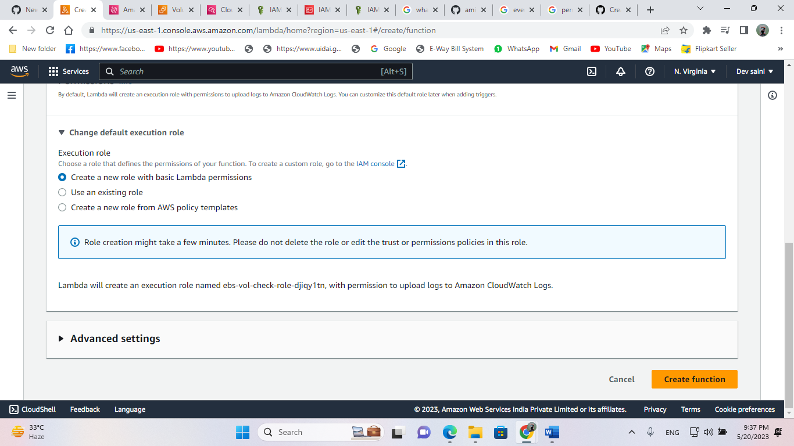

# Event-Driven Architecture for maintaing companies policy for only using EBS volume 'gp3' using for LambdaFunction and CloudWatch, IAM !


1. Create lambda_fun.py using python boto3 and create new role.
<p>
    
</p>
 
2. Create Event rule in AWS CloudWatch.
# Event Pattern:-  
```
  {
    "source": ["aws.ec2"],
    "detail-type": ["EBS Volume Notification"],
    "detail": {
      "event": ["createVolume"]
    }
  }
```

3. Adding policies to role "ebs_vol_check-role-c8edb2k1" created by Lambda
# Permissions policies --> Ebs-volume-check:-
```
{
    "Version": "2012-10-17",
    "Statement": [
        {
            "Sid": "VisualEditor0",
            "Effect": "Allow",
            "Action": [
                "ec2:ModifyVolume",
                "ec2:ModifyVolumeAttribute",
                "ec2:CreateVolume"
            ],
            "Resource": "*"
        }
    ]
}
```
